# DB_SCHEMA.md — PostgreSQL 정본 스키마

상태: **ACTIVE**  
대상 schema: `dc`  
실행 가능한 DDL 정본: `backend/migrations/*.sql`

이 문서는 ERD, 이름 규칙, DDL 변경 순서를 소유한다. 컬럼의 정확한 type/default/constraint는 migration SQL이 최종 근거다. 스키마를 바꾸는 작업은 migration과 이 문서를 한 커밋에서 함께 갱신한다.

## 1. 네이밍 규칙

| 대상 | 표준 | 예 |
|---|---|---|
| schema | 짧은 소문자 단수 | `dc` |
| table | **단수형 `snake_case`** | `job_application`, `growth_entry` |
| column | `snake_case` | `student_uid`, `created_at` |
| 일반 PK | `id`; 외부 정체성 PK는 도메인명 유지 | `id`, `intg_uid` |
| FK | 참조 의미 + `_id`; 사람 정체성은 `_uid`; 코드값은 `_code` | `request_id`, `student_uid`, `status_code` |
| boolean | 긍정형 `is_*`, `has_*`, 또는 명확한 상태 동사 | `is_active`, `wished` |
| timestamp | `timestamptz`; 사건 시각은 `*_at` | `created_at`, `occurred_at` |
| 날짜만 | `date`; 이름은 `*_date` 또는 업무상 자연어 | `deadline_date` |
| 변경 추적 | `created_at/by`, `updated_at/by`; soft delete는 `deleted_at/by` | — |
| version | 낙관적 잠금이 필요한 mutable aggregate에 integer `version` | `roadmap.version` |
| event table | `{aggregate}_event`; append-only | `counsel_event` |
| PK constraint | `pk_{table}` | `pk_job_application` |
| FK constraint | `fk_{table}_{column}` | `fk_job_application_student_uid` |
| unique constraint | `uq_{table}_{purpose}` | `uq_job_stage_position` |
| check constraint | `ck_{table}_{purpose}` | `ck_growth_entry_dates` |
| index | `ix_{table}_{purpose}` | `ix_job_posting_listing` |

기존 migration에 이미 존재하는 이름은 호환성을 위해 유지한다. 새 객체부터 위 표준을 적용하며 단순 이름 통일만을 위한 파괴적 rename migration은 만들지 않는다.

## 2. 설계 규칙

- 학사 원천 데이터는 읽기 전용 projection으로 취급한다.
- FK, unique, check로 표현할 수 있는 정합성은 DB가 보장한다.
- CHECK는 NULL도 통과하므로 nullable 값·빈 배열을 별도로 검증한다. 같은 학생 소유여야 하는 부모/자식 관계는 학생 키를 포함한 복합 FK로 보장한다.
- 상태 전이·배정·코멘트·권유는 event table에 append-only로 쌓는다.
- 화면 표시용 파생값과 통계는 원본 행에 중복 저장하지 않고 query/view/API에서 계산한다. 성능상 물질화가 필요하면 갱신 계약을 함께 정의한다.
- JSONB는 구조가 실제로 가변적인 payload/snapshot에만 쓴다. 검색·join·권한 판정 필드는 정규 컬럼으로 둔다.
- 모든 목록 API는 예상 filter/sort/pagination query와 이를 받치는 index를 작업지시서에 적는다.
- 개인정보와 역할 권한은 API에서 검사하며 프론트 필터를 보안 경계로 쓰지 않는다.
- migration은 additive 우선, backfill 후 constraint 강화 순서로 작성한다.

## 3. 핵심 ERD

```mermaid
erDiagram
    PERSON ||--o| STUDENT : "is"
    PERSON ||--o| STAFF : "is"
    DEPARTMENT |o--o{ STUDENT : "contains"
    DEPARTMENT ||--o{ ORG_ASSIGNMENT : "scopes"
    STAFF ||--o{ ORG_ASSIGNMENT : "holds"
    STAFF ||--o{ ADVISOR_ASSIGNMENT : "advises"
    STUDENT ||--o{ ADVISOR_ASSIGNMENT : "assigned"

    STUDENT ||--o{ COUNSEL_REQUEST : "requests"
    STAFF |o--o{ COUNSEL_REQUEST : "handles"
    COUNSEL_REQUEST ||--o| COUNSEL_RECORD : "produces"
    COUNSEL_REQUEST ||--o{ COUNSEL_EVENT : "records"
    STUDENT ||--o{ ADVISOR_ASSIGNMENT : "assignment history"
    STAFF ||--o{ ADVISOR_ASSIGNMENT : "advises"

    STUDENT ||--o{ DIAGNOSIS_ATTEMPT : "takes"
    DIAGNOSIS_ATTEMPT ||--o| DIAGNOSIS_RESULT : "has"
    STUDENT ||--o{ STUDENT_TYPE_EVENT : "classified"

    PROGRAM ||--o{ PROGRAM_APPLY : "receives"
    STUDENT ||--o{ PROGRAM_APPLY : "submits"
    PROGRAM ||--o{ PROGRAM_WISHLIST : "saved"
    STUDENT ||--o{ PROGRAM_WISHLIST : "owns"

    STUDENT ||--o| ROADMAP : "owns"
    ROADMAP ||--o{ ROADMAP_AXIS : "contains"
    ROADMAP_AXIS ||--o{ ROADMAP_ITEM : "contains"
    STUDENT ||--o{ ROADMAP_SNAPSHOT : "retains"
    STUDENT ||--o{ ROADMAP_EVENT : "records"

    STUDENT ||--o| GROWTH_PROFILE : "owns"
    GROWTH_PROFILE ||--o{ GROWTH_ENTRY : "contains"
    GROWTH_PROFILE ||--o{ GROWTH_EVENT : "records"
    GROWTH_ENTRY |o--o{ GROWTH_EVENT : "references"
    GROWTH_ENTRY ||--o{ GROWTH_ENTRY_FILE : "attaches"

    COMPANY |o--o{ JOB_POSTING : "publishes"
    JOB_POSTING ||--o{ JOB_STAGE : "defines"
    JOB_POSTING ||--o{ JOB_APPLICATION : "receives"
    STUDENT ||--o{ JOB_APPLICATION : "submits"
    JOB_APPLICATION ||--o{ JOB_APPLICATION_ATTEMPT : "retries"
    JOB_APPLICATION ||--o{ JOB_APPLICATION_EVENT : "records"
```

ERD의 세부 보조·코드·권한·AI·파일 테이블은 아래 migration 인덱스와 실제 DDL을 따른다.

권한 범위 `dc.staff_student_scope` 는 테이블이 아니라 **뷰**다(009). `fixture_student_scope`(개발 fixture 명시 부여) ∪ `org_assignment` 파생(교직원↔학과, 학생의 `(college_code,dept_code)` 로 조인) ∪ `advisor_assignment` 활성 행(교수↔학생 1:1, 0003 예정). 권한을 행으로 복사해 동기화하지 않는다 — 배정 표가 곧 권한이다.

`dc.seed_source.path` 는 **최초 import 시점의 원본 경로를 보관하는 키**다(`src_v2/data/…`·`src_admin/data/…`). 시드 파일의 물리 위치가 `backend/seeds/{v2,admin}/` 로 옮겨져도(0003) 키는 바뀌지 않는다 — `import_issue.source_path` FK 와 013·023·026·038 의 backfill 리터럴이 이 키를 참조한다. `seed.py` 가 물리 경로 → 키 매핑을 담당한다.

## 4. DDL migration 인덱스

| 번호 | 파일 | 소유 영역 |
|---|---|---|
| 001 | `001_foundation.sql` | person/student/학사 projection/역량 기초 |
| 002 | `002_counsel_roadmap.sql` | 상담·진단·프로그램·로드맵 기초 |
| 003–008 | `003_access.sql`–`008_precomputed_diagnosis.sql` | 접근 범위·idempotency·교수배정·진단 보강 |
| 009–014 | `009_administration.sql`–`014_counsel_topic_reference.sql` | 코드·권한·조직·메뉴·상담 주제 |
| 015–017 | `015_diagnosis_events.sql`–`017_factor_label_management.sql` | 진단 이벤트·요인 정의 |
| 018 | `018_program_operations.sql` | 비교과 운영·신청·벌점 |
| 019–021 | `019_ai_artifacts.sql`–`021_ai_resume_review.sql` | AI 실행·산출물·이력 |
| 022–023 | `022_job_operations.sql`–`023_job_seed.sql` | 채용·기업·지원·찜·자소서 |
| 024 | `024_roadmap_operations.sql` | 로드맵 생성·수정·요청·스냅샷 |
| 025–026 | `025_growth_operations.sql`–`026_roadmap_growth_backfill.sql` | 성장·포트폴리오·비교과 찜·backfill |
| 027 | `027_counsel_type_code.sql` | 상담 종류 코드 보정·필수화·트랙 정합성 |
| 028 | `028_followup_diagnosis_scores.sql` | 시연용 후속진단 결과 보정·적재 (운영 적용 위험은 아래 평가서 참조) |
| 029 | `029_constraint_null_gaps.sql` | 비교과 CHECK 두 개의 NULL·빈 배열 통과 구멍 교정 (F3) |
| 030 | `030_history_ownership_fk.sql` | 진단 코멘트·로드맵 요청이력의 학생 소유권 복합 FK (F5) |
| 031 | `031_diagnosis_lookup_index.sql` | 진단 코멘트·권유·유형이력 최신 1건 조회 인덱스 (F4) |
| 032 | `032_student_list_live_counts.sql` | 명단의 상담·비교과 집계를 roster JSON 에서 실적 조회로 교체 (F2) |
| 033–034 | `033_diagnosis_factor_identity.sql`–`034_diagnosis_factor_backfill.sql` | 진단 요인 정체성·backfill |
| 035 | `035_counsel_operations.sql` | 상담 운영(가용시간·제외시간·집단상담·운영 이벤트) |
| 036–037 | `036_communications.sql`–`037_notification_delivery.sql` | 공지·알림·알림 배달 트리거 |
| 038 | `038_counsel_fixture_backfill.sql` | 상담 운영 fixture backfill (시드 후 재실행) |
| 039–041 | `039_authority_inheritance.sql`–`041_admin_menu_seed.sql` | 권한 계승(`auth_role` 보강·`auth_user_event`)·권한 시드·관리자 메뉴 시드 |
| 042 | `042_student_list_truth.sql` | 0003 E1 — `dc.student_list` 재정의: 유형=`student_type_event`만, 이수·상담 건수=이벤트 count, `roster` jsonb 폴백 제거. 의존 뷰 `diagnosis_status` 재생성 |
| 043 | `043_student_department_backfill.sql` | 0003 E1 — 더미 학생 `(college_code,dept_code)` 유일성 가드 backfill (시드 후 재실행) |
| 044 | `044_staff_profile_merge.sql` | 0003 E2 — 교수 그룹 항목 키(`title·major·room`)를 `staff.profile`에 병합 |
| 045 | `045_advisor_assignment.sql` | 0003 E3 — `dc.advisor_assignment` + release-once 트리거 + `staff_student_scope` 뷰 세 번째 가지 + 학과 인덱스 2개 |
| 046 | `046_advisor_assignment_backfill.sql` | 0003 E3 — 배정 fixture·조교/교수 `org_assignment` fixture (시드 후 재실행) |
| 047 | `047_main_popup.sql` | 0003 E5a — `dc.main_popup`(학생 메인 캐러셀). 공지와 생명주기가 달라 별도 표(설계안 `notice.kind` 대신) |
| 048 | `048_main_popup_seed.sql` | 0003 E5a — 팝업 시드 (시드 후 재실행) |
| 049 | `049_counsel_topic_group_by_type.sql` | 0003 E4 — `counsel_request.topic_group` 생성식을 `type_code`로 분기(PROF→`PROF_COUNSEL_TYPE`). 교수상담 분류가 기존 코드 그룹으로 FK 검사됨 |
| 050 | `050_prof_counsel_record_backfill.sql` | 0003 E4 — 교수 발의 상담 fixture 7건 → `counsel_request(DONE)`+`counsel_record`+이벤트 (시드 후 재실행) |
| 051 | `051_professor_organization.sql` | 교수 소속의 유일한 대학·학과 일치만 코드 배정으로 이관. 미해결 소속은 import_issue 기록 |
| 052 | `052_gpa_policy.sql` | 명시적 GPA 정책·학기 순서, 수강학점 가중평균 함수와 학생 목록 연결. 정책 자동 활성화 없음 |
| 053 | `053_academic_mirror.sql` | 별도 `academic` 스키마에 학사 원본 9개 테이블·174개 컬럼과 검증 이력 `sync_run`. 원본 PK를 추정하지 않으며 중복 행도 보존. `dc` 업무 데이터 변경 없음 |
| 054 | `054_academic_staff_mirror.sql` | 상담사 등록·담당 단대·조교 담당 학과 원본 3개 테이블, 59컬럼 보관 |
| 055 | `055_academic_directory.sql` | 관리자 인원·조직·상담사·조교 배정·겸직 읽기 뷰. 원본 스키마와 비밀번호 노출 차단 |
| 056 | `056_academic_directory_menu.sql` | 회원관리의 학사 인원·조직 조회 메뉴 등록 |
| 057 | `057_psych_test_result.sql` | 0004 — `dc.psych_test_result`: 심리상담 신청 1건당 결과 1건(`request_id` UNIQUE), 척도 jsonb, DRAFT/DONE. 마지막 localStorage 업무 데이터(`dc_psych_tests`) 퇴역 |
| 058 | `058_psych_menu.sql` | 0004 — 심리상담사 `menu_auth`에서 진단 관리·집단상담 제거(CARE 7+ 소속), `counsel.6` 추가 심리상담신청 등록 |
| 062 | `062_retire_roster_dummies.sql` | 로스터 더미 학생(`studentsRoster.json` 112 + `counselSeedStudents.json` 5) 및 종속 행 전부 삭제. `person.source='fixture'` 이고 상세 3명이 아닌 학생만. append-only 가드는 이 마이그레이션 안에서만 내린다. 시드도 더 이상 더미를 만들지 않는다(`seed.py`) |
| 059 | `059_student_login.sql` | 학사 학생 로그인 조회 뷰·로컬 정보 재정의·8시간 세션 |
| 060 | `060_requested_student.sql` | 요청 학생 20180001 홍길동을 로컬 서비스 DB에 등록. 원본 변경 없음 |
| 061 | `061_student_login_enrollment_permissions.sql` | 확인된 학사 학생의 최초 로그인 등록 권한 |

다음 migration 번호는 작업 시작 시 `backend/migrations/`를 다시 조회해 결정한다. 이미 사용된 번호나 파일은 수정하지 않는다.

2026-09-10 로컬 `dreamcatch` 읽기 전용 실측: migration 28개(029~032 적용 후 32개), 테이블 77개, view 5개, index 144개(PK/UNIQUE 포함), FK 172개, CHECK 139개. 운영 서버 실측값은 아니다. 구조 평가·미해결 사항은 [.ai/db/SCHEMA_REVIEW_2026-09-10.md](.ai/db/SCHEMA_REVIEW_2026-09-10.md)에 기록한다. 이 수치는 migration 추가 시 달라진다.

## 5. 변경 체크리스트

- [ ] ERD 관계 반영
- [ ] 새 table/column/index/constraint 이름 표준 확인
- [ ] query와 index 대응표가 작업지시서에 있음
- [ ] seed/backfill/rollback 또는 roll-forward 복구 절차가 있음
- [ ] mock JSON → API response 계약 테스트가 있음
- [ ] `DB.md` §8-3 이관 상태 갱신
