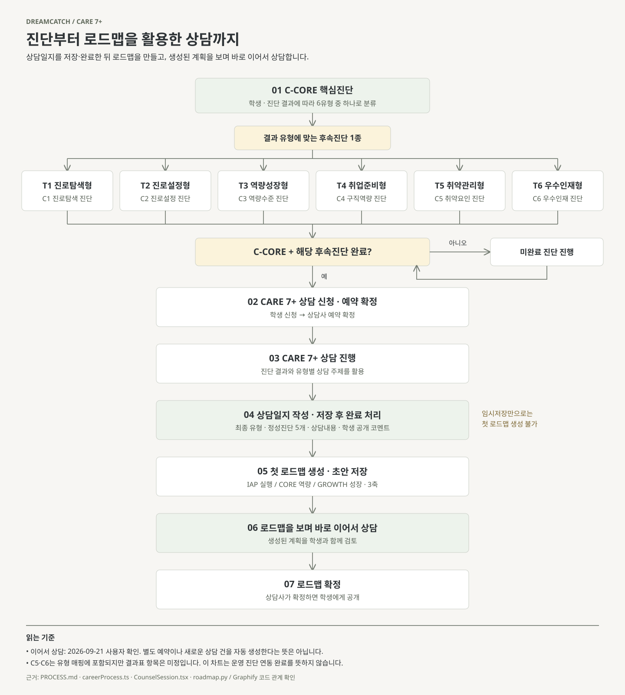

# CARE 7+ 진단·상담·로드맵 플로우

2026-09-22: [학생 접근·미접촉자 정책](STUDENT_CONTACT_POLICY.md) 적용. 담당학생 분류 없이 모든 상담사가 전체 학생을 조회·수정한다. 재학생 중 진단 미완료, 진단 완료 후 상담 미완료, 진단·상담 완료 후 로드맵 미생성을 각각 집계한다. 상담 완료 뒤 시간 부족으로 초안 생성을 미룬 학생은 로드맵 탭에 남는다. 기존 아래 생성 순서는 유지하며, 일반 진로취업상담도 CARE 7+와 동일 양식(유형 변경만 불가)을 사용한다.

2026-09-21 사용자 확인 및 현재 체크아웃 기준.



- [SVG 차트](CARE7_FLOW.svg): 브라우저에서 열거나 확대·인쇄할 수 있는 독립 파일.
- [Mermaid 원본](CARE7_FLOW.mmd): 6유형 분기와 진단 미완료 경로를 수정할 수 있는 원본.
- [Graphify 코드 관계 그래프](../_workspace/graphify-care7/graphify-out/graph.html): 관련 코드 21개에 대한 로컬 탐색용 산출물. Git에는 포함하지 않는다.

## 확정된 순서

C-CORE → 결과 유형의 후속진단 1종 → CARE 7+ 상담 신청·예약 확정 → 상담 진행 → **상담일지 작성·저장 후 완료 처리** → 첫 로드맵 생성·초안 저장 → **로드맵을 보며 바로 이어서 상담** → 로드맵 확정·학생 공개.

사용자 확인: “process가 맞다 상담일지 저장 -> 로드맵 생성 -> 또 이어서 바로 상담이야”. 이어서 상담하는 단계는 이 확인을 반영한 업무 흐름이다. 새로운 상담 신청이나 예약을 자동 생성하는 API 전이로 표현하지 않았다. 후속 상담내용을 별도 신규 일지로 저장하는 규칙은 추가하지 않았다.

| C-CORE 유형 | 후속진단 | 상담 주제 코드 |
|---|---|---|
| T1 진로탐색형 | C1 진로탐색 진단검사 | A01~A04 |
| T2 진로설정형 | C2 진로설정 진단검사 | A05~A08 |
| T3 역량성장형 | C3 역량수준 진단검사 | A09~A12 |
| T4 취업준비형 | C4 구직역량 진단검사 | A13~A16 |
| T5 취약관리형 | C5 취약요인 진단검사 | A17~A20 |
| T6 우수인재형 | C6 우수인재 진단검사 | A21~A24 |

## 해석과 근거

- 유형 매핑·순서: [PROCESS.md §4·§5](../PROCESS.md), [careerProcess.ts](../src_v2/data/careerProcess.ts).
- C-CORE와 해당 후속진단 완료가 CARE 7+ 신청 조건이다. 일반 진로취업·심리·교수 상담은 이 게이트에 포함되지 않는다: [gates.py](../backend/app/gates.py), [CareerCounsel.tsx](../src_v2/pages/counsel/CareerCounsel.tsx).
- **임시저장만으로 첫 로드맵을 생성할 수 없다.** [CounselSession.tsx](../src_admin/pages/CounselSession.tsx)의 `handleComplete`와 [roadmap.py](../backend/app/roadmap.py)의 `check_counsel_basis(initial=True)`를 확인했다. 상담 상태 `DONE`이 필요하다.
- 일지에는 최종 유형·정성진단 5개·선택 상담내용·학생 공개 코멘트를 기록한다. 내부 상담 본문과 정성진단은 학생에게 공개하지 않는다: [COUNSEL_TEMPLATE.md](COUNSEL_TEMPLATE.md), [CounselRecordFields.tsx](../src_admin/components/CounselRecordFields.tsx).
- 로드맵은 IAP·CORE·GROWTH 3축의 초안으로 생성하고 상담사가 확정하면 학생에게 공개한다. 차트는 **첫 생성** 기준이다. 기존 로드맵의 재생성은 확정 예약 상태의 재상담에서도 가능한 별도 조건이 있다: [roadmap.py](../backend/app/roadmap.py).
- C5·C6의 유형 매핑은 정의되어 있지만 결과표 항목은 미정이다. 외부 진단 연동·실제 채점·운영 모델 연결이 모두 완료됐다는 뜻은 아니다: [DIAGNOSIS_RESULT_CONTRACT.md](DIAGNOSIS_RESULT_CONTRACT.md).
- [ROADMAP_GENERATION.md](ROADMAP_GENERATION.md)의 2026-09-14 완료 설명과 이후 규칙이 다른 부분은, 2026-09-18에 갱신된 PROCESS.md와 현재 원본 코드를 우선했다.

## Graphify 설치·분석 기록

[공식 설치 안내](https://github.com/Graphify-Labs/graphify)에 따라 `uv tool install graphifyy`로 **0.9.65**를 설치했다. `graphify install --platform codex`로 `C:/Users/njob/.codex/skills/graphify/SKILL.md`와 references를 설치했다.

분석은 관련 소스 21개에 한정한 로컬 AST 방식이다. 외부 모델 호출이나 DB 조회·변경 없이 실행했다. 업무 차트는 Graphify의 코드 관계를 조회하고 원본·문서·사용자 확인을 대조해 작성했으며, Graphify가 업무 규칙을 자동 판정한 결과가 아니다.

결과: **540 노드 / 1,049 연결 / 27 커뮤니티**. `graphify explain check_counsel_basis`에서 생성·재생성의 호출 관계, CARE 7+ 판정과 실패 처리 연결을 확인했다. Graft CLI 조회도 관련 함수·호출자를 확인하면서 변경 파일 5개를 자동 갱신했다.

Graphify 무결성 진단에는 **미해결 끝점 연결 240개**, **같은 방향·끝점 연결의 축약 위험 17개**가 보고됐다. 누락 끝점 필드와 자기 참조는 0개다. 제한된 코드 범위의 구조 그래프를 전체 프로그램 호출·HTTP·업무 전이의 완전한 증거로 사용하지 않는다. 상세 수치는 로컬 `graph-health.json`에 남겼다.

재생성:

```powershell
uv tool run --from graphifyy python tools/graphify/build_care7_graph.py
graphify export html --graph _workspace/graphify-care7/graphify-out/graph.json
graphify explain check_counsel_basis --graph _workspace/graphify-care7/graphify-out/graph.json
python tools/graphify/render_care7_flow.py
```

검증: SVG XML 파싱 성공. Headless Chrome으로 SVG를 렌더링한 1440×1600 스크린샷에서 한글, 6유형 분기, 화살표와 하단 주석이 잘리지 않는 것을 확인했다. 이는 정적 문서 렌더 검증이며 Chrome MCP를 통한 앱 화면·API·네트워크 검증은 수행하지 않았다. 앱 코드나 DB 동작은 변경하지 않았다.
