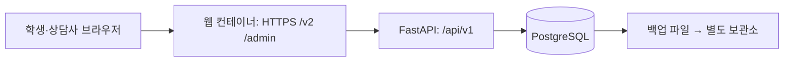

# 드림캐치 PostgreSQL·백엔드 구축 기획 v1

작성일: 2026-09-08 · **갱신: 2026-09-09** · 상태: **상당 부분 구현됨** — 아래 「구현 반영」 참조

> ## 구현 반영 <span>(2026-09-09)</span>
> 이 문서는 구축 **전에** 쓴 제안이다. 그 뒤 실제로 구축이 진행됐고, 결정이 갈린 곳이 있다.
> **충돌하면 실제 스키마(`backend/migrations/`)와 `DB.md`가 우선한다.**
>
> - **완료** — PostgreSQL 17 Docker 설치 · 스키마·권한 · FastAPI · 상담 왕복 · 코드/메뉴/조직 관리 · 진단 조회 · 비교과 운영. 마이그레이션 18개 · 엔드포인트 51개 · 통합테스트 29개
> - **테이블 이름 규약이 바뀌었다** — 제안의 `dc_xxx` 접두사 대신 **`dc` 스키마 + 짧은 이름**을 쓴다(`dc.counsel_request`). 본문의 이름은 실제 스키마로 갱신했다.
>   일부는 이름 자체가 바뀌었다: `dc_code`→`dc.code_item` · `dc_dept_assign`→`dc.org_assignment` · `dc_roadmap_history`→`dc.roadmap_item_event` · `dc_auth`→`dc.auth_role` · `dc_seed_run`→`dc.seed_source`
> - **아직 만들지 않은 테이블** — `dc_credential` · `dc_session` · `dc_consent` · `dc_access_audit` · `dc_dept_lineage` · `dc_local_user` · `dc_counselor` · `dc_counselor_college` · `dc_counsel_slot` · `dc_counsel_request_topic` · `dc_counsel_intake_answer` · `dc_counsel_record_revision` · `dc_counsel_link` · `dc_group_counsel` · `dc_group_member`.
>   이름 앞에 `dc_` 가 남아 있으면 **아직 논리 제안 단계**라는 뜻이다. 도메인별 진행 상태는 **`DB.md` §8-3 이관 대장**이 정본이다.
> - **설계가 갈린 곳** — 상담 슬롯은 별도 테이블 대신 `counsel_request` 인라인 컬럼 + advisory lock, 상담 주제는 복수 대신 단일 `topic_code`, `dc.roadmap` 에 `generation`·상담 FK·최종 유형 없음(§7.2 재생성 정책이 아직 구현 불가한 이유다)

## 1. 목적과 결정의 경계

현재 React 화면은 JSON 원본과 localStorage override를 데이터 계층에서 연결한 프로토타입이다. 이 구조를 **React → FastAPI → PostgreSQL**로 전환하여 서로 다른 PC·브라우저에서도 학생 신청과 상담사 처리가 이어지는지 검증한다. 이후 iwin VPS에서 프론트엔드·백엔드·DB의 통합 운영 테스트를 수행하고, 검증한 컨테이너 이미지를 학교 VM으로 이전한다.

작성 시점에는 서버 접속·설치·구현을 수행하지 않았고, 아래 명령과 설정은 후속 구축용 절차였다. **그 절차는 이후 실제로 실행됐다.** 접속 비밀번호는 문서에 기록하지 않는다.

| 구분 | 적용 기준 |
|---|---|
| 기존 확정 | `DB.md` §8-4: PostgreSQL + Docker Compose, FastAPI, 초기 백엔드는 로컬 PC, 첫 대상은 상담 |
| 사용자 요청 반영 | 초기 배선 검증 이후 같은 VPS에 프론트엔드·백엔드도 배포하여 통합 운영 테스트 수행 |
| 스키마 정본 | 사람이 작성한 SQL 파일. ORM 자동 생성 DDL을 정본으로 삼지 않음 |
| 업무 정본 | `SPEC.md` 화면·코드 / `PROCESS.md` 프로세스 / `DB.md` 소유권·이관·미결 |
| 이 문서의 제안 | DB 버전, 폴더 구조, API 계약, 세부 테이블·트랜잭션, 설치 및 운영 절차 |
| 보류 | RAG, pgvector, 임베딩, LLM 배포, AI 분석 DB 구축, Oracle 이관 스크립트 |
| 학교 배포 | PostgreSQL 컨테이너 허용을 전제로 한 목표 구성. 운영 DBMS는 `DB.md` #39가 닫힐 때 확정 |

`DB.md`의 “성능·운영이 목적이 아니다”는 초기 배선 검증 단계에 적용하고, 사용자가 요청한 운영 테스트는 그 다음 단계로 추가한다. 미결의 정본은 `DB.md` §9다.

### 1.1 확인한 현행 코드와 명세의 차이

| 확인 지점 | 현재 구조 | 전환 계획 |
|---|---|---|
| `src_v2/data/students.ts` | 학생별 상담 배열 + `dc_counsel_owners` override | 학생 참조와 상담 신청 행을 분리. owner는 조회용 DTO로 유지 |
| `src_v2/data/counselRequestsWrite.ts` | 동기 `void` 반환, 브라우저 시각으로 ID 생성 | 비동기 API 호출, 서버 ID·시각, 저장 성공 후 갱신 |
| `src_admin/data/counselRequests.ts` | 상태 수정 후 별도로 이벤트 추가 | 신청·기록·이벤트를 서버 트랜잭션으로 처리 |
| `src_admin/data/schema/counselRequest.ts` | `진로취업/심리`, `대기/확정/완료/취소` | 명세 코드와 DTO 사이에 명시적 변환 계층 필요 |
| `src_admin/data/schema/counselRecord.ts` | `summary`와 `comment`, 공개 여부 필드 미비 | 내부 소견과 공개 코멘트 분리 및 서버 응답 필터 |
| `SPEC.md` §7-0 | `src_v2/data/codes/`는 아직 미구현으로 명시 | 코드 정본을 먼저 구성하고 DB 시드·Python 계약으로 생성 |
| `SPEC.md` S1의 상담 전체 잠금 문구 | 최신 프로세스와 충돌하는 잔재 | `PROCESS.md` §2-1 우선. 일반·심리·교수상담은 진단 게이트 밖 |
| 기존 ERD | 설계 참고 자료이며 과거 로드맵 표현 잔재 존재 | 최신 `PROCESS.md`와 대조 후 SQL 작성. ERD 전체를 바로 실행하지 않음 |

## 2. 서버 구성과 도입 단계

대상: iwin 제공 `vgna_2_n`, Rocky Linux 9.x, `115.68.178.124`, 2 vCPU / RAM 2GB / SSD 50GB / 네트워크 2.5Gbps. 실제 OS 세부 버전·CPU 아키텍처·기존 서비스·디스크 여유는 아직 원격 확인하지 않았다.



| 단계 | 프론트엔드 | 백엔드 | DB | 완료 기준 | 상태 |
|---|---|---|---|---|---|
| A: 개발 배선 | 로컬 Vite | 로컬 FastAPI | VPS Docker | 일반 상담 신청→확정→기록→완료 왕복 | **완료** |
| B: 통합 테스트 | VPS 웹 컨테이너 | VPS API 컨테이너 | 동일 VPS DB | 별도 브라우저·권한·동시성·재시작·복구 검증 | **진행 중** — API 는 VPS 컨테이너에서 돈다 |
| C: 학교 VM | 동일 이미지 | 동일 이미지 | 승인된 DB 구성 | 복원·연계·TLS·인증 검증 후 전환 | 미착수 (`DB.md` #39 대기) |

> **A 단계에 로컬 전용 경로가 하나 늘었다** — DB·API 를 모두 내 PC 의 Docker/uvicorn 으로 띄우는 구성이다.
> VPS 없이 화면을 볼 수 있고 테스트도 여기서 돌린다 → [`docs/LOCAL_DEV.md`](docs/LOCAL_DEV.md)

처음부터 DB를 Docker로 설치한다. 호스트 RPM PostgreSQL을 별도로 함께 설치하면 서비스·포트·데이터 디렉터리를 두 벌 관리하게 되므로 이 계획의 기본 경로에서는 사용하지 않는다. Rocky 계열의 네이티브 설치 자체는 [PostgreSQL 공식 설치 안내](https://www.postgresql.org/download/linux/redhat/)에서 확인할 수 있다.

### 2.1 권장 스택과 자원 예산

| 구성 | 제안 | 이유·제약 |
|---|---|---|
| DB | PostgreSQL 17, 설치 시 지원 중인 최신 17.x 패치 확인 후 digest 고정 | 개발 기준 버전. 학교 운영 DB 확정과 구분 |
| API | Python 3.12 + FastAPI + Pydantic + SQLAlchemy 2 + psycopg 3 | 타입 검증·SQL 파라미터 바인딩·트랜잭션. 의존성은 lock 파일로 고정 |
| API 실행 | Uvicorn worker 1개로 시작 | 2GB에서 프로세스별 메모리 중복 최소화 |
| 웹 | Nginx 등 경량 웹 서버 1개에 두 SPA 정적 빌드 배치 | `/v2`와 `/admin` 독립 진입점, `/api/v1` 프록시 |
| 작업 실행 | 초기 DB 작업 테이블 + 단일 작업 실행기 | Redis·Celery·상시 관리 UI는 초기 구성에서 제외 |
| 빌드 | 로컬 PC 또는 CI | VPS에서 Node/Python 이미지 빌드와 서비스 운영의 메모리 경합 방지 |

PostgreSQL은 메이저 버전별 지원 기한을 확인하고 패치를 적용한다. 메이저 업그레이드는 이미지 태그 교체만으로 처리하지 않는다. [PostgreSQL 버전 정책](https://www.postgresql.org/support/versioning/)

초기 **측정 전 예산**은 DB 640MB, API 512MB, 웹 128MB, OS·Docker·파일 캐시 및 여유 약 768MB다. DB 연결은 API pool 5개 + overflow 5개, 전체 DB `max_connections=30`으로 시작한다. PostgreSQL `shared_buffers=128MB`, `work_mem=4MB`, `maintenance_work_mem=64MB`는 출발값이며 메모리 사용의 상한이 아니다. 쿼리 하나도 여러 정렬·해시 작업을 수행할 수 있다.

통합 테스트는 소규모 검증으로 간주한다. 동시 접속 수를 아직 알 수 없으므로 “2GB로 대학 전체 운영 가능”을 전제하지 않는다. OOM, swap 지속 사용, 연결 대기 또는 응답 지연이 발생하면 쿼리 개선과 RAM 증설을 판단한다. FastAPI 컨테이너 실행 방식은 [공식 배포 문서](https://fastapi.tiangolo.com/deployment/docker/)를 따른다.

## 3. Rocky Linux에서 PostgreSQL 설치하기

아래 서버 명령은 **Bash 기준**이다. 로컬 PowerShell 명령과 구분하여 실행한다. 신규 서버라도 기존 Docker·Podman·DB·방화벽 규칙을 확인한 뒤 진행하며 기존 패키지를 일괄 삭제하지 않는다.

### 3.1 사전 확인과 Docker 설치

초기 root 접속은 서버 준비에만 사용하고 SSH 키를 가진 운영 계정으로 전환한다. 제공된 root 비밀번호는 후속 초기 설정에서 교체하고 SSH 키 접속이 확인된 뒤 root 원격 로그인 정책을 제한한다. DB 암호는 서버 로그인 암호와 별도로 생성한다.

```bash
cat /etc/rocky-release
uname -m
free -h
df -h
ss -lntp
getenforce

sudo dnf install -y dnf-plugins-core openssl
sudo dnf config-manager --add-repo https://download.docker.com/linux/rhel/docker-ce.repo
sudo dnf install -y docker-ce docker-ce-cli containerd.io docker-buildx-plugin docker-compose-plugin
sudo systemctl enable --now docker
sudo docker version
sudo docker compose version

sudo install -d -m 700 /opt/dreamcatch
sudo install -d -m 700 /opt/dreamcatch/secrets
sudo install -d -m 700 /opt/dreamcatch/backups
```

Docker 저장소·설치 명령은 [Rocky Linux 공식 Docker 안내](https://docs.rockylinux.org/gemstones/containers/docker/) 기준이다. SELinux는 유지한다. 추후 bind mount가 필요하면 파일 소유권과 SELinux label을 함께 설정한다. DB는 named volume으로 시작한다.

### 3.2 DB 전용 Compose 초안

후속 작업에서 `/opt/dreamcatch/compose.db.yaml`로 저장한다. **아래 파일은 DB 기동용이며 API 테이블·앱 계정까지 생성하는 파일은 아니다.** `postgres:17-bookworm`은 최초 이미지 확보용 태그다. 검증한 이미지의 RepoDigest를 릴리스 기록에 남기고 재배포 시 해당 digest로 잠근다.

```yaml
name: dreamcatch
services:
  db:
    image: postgres:17-bookworm
    restart: unless-stopped
    mem_limit: 640m
    shm_size: 128mb
    environment:
      POSTGRES_DB: dreamcatch
      POSTGRES_USER: postgres
      POSTGRES_PASSWORD_FILE: /run/secrets/postgres_password
      POSTGRES_INITDB_ARGS: "--encoding=UTF8 --auth-host=scram-sha-256"
      TZ: Asia/Seoul
    command:
      - postgres
      - -c
      - max_connections=30
      - -c
      - shared_buffers=128MB
      - -c
      - work_mem=4MB
      - -c
      - maintenance_work_mem=64MB
      - -c
      - timezone=UTC
    ports:
      - "127.0.0.1:5432:5432"
    volumes:
      - pgdata:/var/lib/postgresql/data
    secrets:
      - postgres_password
    healthcheck:
      test: ["CMD-SHELL", "pg_isready -U postgres -d dreamcatch"]
      interval: 10s
      timeout: 5s
      retries: 5
      start_period: 20s
    logging:
      driver: json-file
      options:
        max-size: "10m"
        max-file: "3"
secrets:
  postgres_password:
    file: ./secrets/postgres_password
volumes:
  pgdata:
```

PostgreSQL 17의 데이터 mount 경로는 `/var/lib/postgresql/data`다. 18 이상은 공식 이미지 경로 규약이 다르므로 이 설정에서 메이저 태그만 바꾸지 않는다. 초기 환경변수와 init 스크립트는 **빈 데이터 디렉터리에서만** 적용된다. 암호 파일을 바꾸고 재시작하는 것만으로 기존 DB 암호가 변경되지는 않는다. [공식 PostgreSQL 이미지](https://hub.docker.com/_/postgres)

후속 구축자가 Compose 파일을 저장한 뒤, 신규 secret 파일에만 다음 절차를 적용한다.

```bash
sudo bash -c 'umask 077; set -C; openssl rand -hex 32 > /opt/dreamcatch/secrets/postgres_password'
cd /opt/dreamcatch
sudo docker compose -f compose.db.yaml config --quiet
sudo docker compose -f compose.db.yaml pull db
sudo docker compose -f compose.db.yaml up -d db
sudo docker compose -f compose.db.yaml ps
sudo docker compose -f compose.db.yaml exec db psql -U postgres -d dreamcatch -c 'SELECT version(), current_database();'
```

`pg_isready`는 DB가 연결을 받을 준비가 되었는지만 확인한다. 앱 계정 접속·스키마 버전·권한은 별도로 검증한다. VPS 공급자 방화벽과 호스트 방화벽에서 외부 5432를 허용하지 않는다. 바인딩 결과도 `ss -lntp`와 외부 접속 검사로 확인한다.

### 3.3 로컬 PC → 원격 DB 연결

> **실제로는 DB 터널을 쓰지 않는다.** VPS 의 DB 는 API 컨테이너만 접근하고, 로컬에서는
> **API 포트(18000)로 터널**을 연다. 아래 DB 터널은 DBeaver 로 서버 DB 를 직접 들여다볼 때만 쓴다.

운영 계정 `deploy` 및 SSH 키를 준비한 뒤 **로컬 PowerShell**에서 다음 터널을 유지한다.

```powershell
ssh -N -o ExitOnForwardFailure=yes -L 127.0.0.1:15432:127.0.0.1:5432 deploy@115.68.178.124
```

로컬 FastAPI와 DBeaver는 `127.0.0.1:15432`, DB `dreamcatch`, 후속 생성할 `dc_app` 또는 별도 조회 계정을 사용한다. 서버의 공인 IP로 5432에 직접 접속하지 않는다. DB URL은 서버 전용 환경 설정에서 조립하며 `VITE_*`, Git, 브라우저 번들에 넣지 않는다. 특수문자 암호는 드라이버 URL 객체로 전달하여 URL 인코딩 오류를 피한다.

### 3.4 DB 계정과 스키마 권한

| 계정 | 목적 | 권한 |
|---|---|---|
| `postgres` | 최초 구성·복구 | 초기화 관리자. API 사용 금지 |
| `dc_owner` | 객체 소유자 | `NOLOGIN`, 서비스 스키마 소유 |
| `dc_migrator` | 배포 시 SQL 적용 | 제한된 배포 작업에서만 owner 역할 사용 |
| `dc_app` | API 실행 | 필요한 테이블 SELECT/INSERT/UPDATE, 필요한 sequence 권한만 |
| `dc_backup` | 백업 | 백업에 필요한 읽기만, 앱 요청 처리 금지 |

초기 관리 SQL로 계정과 `dc` 서비스 스키마를 만들고 `public`의 불필요한 CREATE 권한을 회수한다. 앱의 `search_path`를 명시한다. 학사 입력 계층은 조회 전용, 이벤트·감사·확정 버전 이력은 앱에 INSERT/SELECT만 부여한다. 기본 권한 설정은 **실제 객체를 생성하는 소유자 역할 기준**으로 작성하여 다음 migration에도 적용한다.

로그인 역할 암호는 대화형 `psql`의 `\password` 또는 배포 secret 주입으로 설정한다. SQL 파일에 암호 리터럴을 넣지 않는다. 이 계정 생성·권한 SQL은 구현 단계 산출물이다.

## 4. 백엔드 구조

모듈형 단일 FastAPI 애플리케이션으로 시작한다. SPA 간 공유는 API 데이터 계약이며 React 컴포넌트나 상태 로직을 서로 import하지 않는다.

```text
backend/
  app/
    main.py
    core/             # 설정·요청자 판정·인가·예외·DB 연결
    modules/
      identity/       # 사용자·조직 조회, 배정 범위
      counseling/     # 신청·일정·기록·이력
      diagnosis/      # 추후: 응시·결과 계약
      roadmap/        # 추후: 확정 계획·칸·변경·스냅샷
      programs/       # 추후: 차수·신청·결과
    jobs/             # 후속 단계의 DB 기반 작업
  tests/
db/
  migrations/postgresql/  # 번호 + 설명.sql, 적용 뒤 수정 금지
  seeds/generated/       # TS 코드 정본에서 생성
  seeds/test/            # 검증 전용 합성 데이터
  contracts/             # 필드·출처·NULL·제약·권한 설명
deploy/
  compose.yaml
  nginx/
  env.example            # 변수 이름만, 실제 secret 없음
```

이 구조는 제안이며 현재 디렉터리를 생성했다는 의미가 아니다. migration 실행기는 파일 번호·checksum·적용 일시를 기록하고 중복 실행을 잠금으로 막는다. ORM `create_all`과 autogenerate는 사용하지 않는다. PostgreSQL 물리 문법은 해당 폴더에 격리하고 업무 규칙은 Python 서비스에 둔다. 운영 DBMS 미확정 상태에서 Oracle 변환 SQL·타입 매핑표를 작성하지 않는다.

### 4.1 요청 처리 순서

`요청 → current_principal → endpoint 권한 → AccessScope → DTO 검증 → 업무 정책 → 트랜잭션 → 역할별 응답`

개발 단계의 헤더 기반 요청자 스텁은 `SPEC.md` §4-2대로 의존성 한 곳에 둔다. 등록된 테스트 사용자만 허용하며 헤더의 역할·단과대·학생 범위를 신뢰하지 않는다. 스텁 API는 로컬 또는 SSH 터널로 제한한다.

VPS의 공개 통합 테스트 전에 로컬 계정 인증을 추가한다. 서버에서 암호 해시를 검증하고 만료·폐기 가능한 세션을 사용한다. 쿠키는 HTTPS의 `Secure`, `HttpOnly`, 적절한 `SameSite` 속성, 변경 요청에는 CSRF 검증을 적용한다. 이후 SSO를 연결해도 `current_principal`의 출력 계약은 유지한다. **인증 스텁이 활성화된 공개 배포는 기동 검사에서 실패시킨다.**

### 4.2 권한과 민감정보

| 역할 | 행 범위 | 주의 |
|---|---|---|
| 학생 | 로그인한 본인 `intg_uid` | 요청 body의 studentId로 타인을 지정할 수 없음 |
| 상담사 | 배정된 단과대 | 기록 수정은 담당자 여부·상담 분야까지 추가 검증 |
| 조교 | 배정 학과·전공, NULL 전공이면 학과 전체 | 상세 공개 범위 #12 미결, 내부 소견 기본 제외 |
| 교수 | 담당 학과 + 지도학생 | 교수상담 별도 도메인·정책 |
| 총괄·관리자 | 허용된 전체 범위 | 전체 학생 접근과 심리 소견 열람 권한을 동일시하지 않음 |

학생 목록·상세·검색 피커·통계·CSV·인쇄·파일 다운로드가 같은 범위 판정을 사용한다. DB 조회 전에 조건을 구성하고 브라우저에서 필터링하지 않는다. 기본 학적 필터는 재학이며 학부·대학원 집합을 포함한다. 수료생 정책은 #6 결정 전 자동 확대하지 않는다.

내부 상담 소견은 학생 응답 DTO에 필드 자체를 포함하지 않는다. 학생 공개 코멘트도 공개 여부를 확인한다. 열람 감사에는 요청자·대상·동작·시각·요청 ID·허용 결과를 남기고 소견 본문·비밀번호·토큰은 기록하지 않는다. 동의 이력과 공개 설정 변경 이력도 보관한다.

## 5. DB 논리 설계

### 5.1 공통 원칙

1. 사람의 식별자는 문자열 `intg_uid`다. 학생 학번·직원 사번에 새 surrogate ID를 만들지 않는다. 외부 위촉 인원은 `source=local` 및 충돌 없는 자체 ID 발급 규칙을 사용한다.
2. 상담·파일·이벤트 등 업무 레코드에는 독립 PK를 둔다. 신규 ID는 서버에서 생성하고 기존 자료의 원본 식별자·출처를 별도로 보존한다.
3. 코드값은 문자열 코드 + 코드 사전 참조. 학적·유형·계층·상담 상태를 한글 표시값으로 저장하지 않는다.
4. 시각은 서버에서 생성하고 PostgreSQL `timestamptz`로 저장한다. API는 ISO 8601, 화면은 Asia/Seoul. 종일 날짜는 `date`로 분리한다.
5. 현행에 없는 업무 필드는 NULL 허용. 신규 API는 필요한 필드를 필수 검증하되 과거 자료의 NULL을 임의 보정하지 않는다.
6. 관계·상태·권한·검색 키는 컬럼과 FK로 표현한다. JSONB는 불변 스냅샷·외부 결과·가변 답변 등 한정된 용도로만 사용한다.
7. 최신 상태와 변경 이력을 같이 관리한다. 상태 갱신과 이력 append는 하나의 트랜잭션이며 과거 확정 이력을 덮어쓰지 않는다.
8. 학사 원본에 물리 FK를 걸 수 없을 때 조회 어댑터 검증·누락 탐지를 사용한다. 학사 마스터를 서비스 CRUD 테이블로 복제하지 않는다.

### 5.2 공통 기반 테이블·조회 모델

아래 명칭은 **논리 제안**이다. 최종 DDL 작성 전에 기존 ERD 명칭과 대응표를 작성한다. `PK`는 기본키, `FK`는 외래키, `UQ`는 유일 제약이다.

| 모델 | 주요 컬럼·키 | 소유권·설계 |
|---|---|---|
| `academic_users` 조회 인터페이스 | `intg_uid`, 이름, 신분, 학적, 과정, 학년, 단대·학과·전공 코드 | 학사 읽기 전용. 초기에는 별도 fixture 스키마의 합성 데이터로 구현 |
| `academic_orgs` 조회 인터페이스 | 조직코드, 상위코드, 명칭, 종류, 과정, 사용여부 | `V_DEP_INF_ALL` 기준 단일 트리. 데이터 공급 방식은 학교 협의 |
| `dc_local_user` | `intg_uid PK`, 이름, 활성, source | 외부 상담사 등 자체 발급 인원만. 학사 야간 적재와 분리 |
| `dc_credential`, `dc_session` | 자격증명 ID, 사용자 식별자, hash / session hash, 만료, 폐기 | 자체 로그인용. 학사 프로필의 사본 아님 |
| `dc.auth_role`, `dc.auth_user`, `dc.menu`, `dc.menu_auth` | 역할 PK, 사용자-역할 UQ, 메뉴 PK, 역할-메뉴 UQ | 기존 4테이블 권한 모델 계승. 자동 역할은 신분에서 파생 |
| `dc.org_assignment` | PK, 사용자, 역할, 단대, 학과, nullable 전공, 유효기간 | 단대+학과 쌍으로 조회. 활성 배정 중복 금지, NULL 전공도 중복 방지 |
| `dc.admin_event` | PK, 배정 FK, 동작, 처리자, 시각 | 배정·해제 append-only |
| `dc_dept_lineage` | PK, 이전/이후 조직 코드 쌍, 개편 종류, 시행일, 사유 | 분리·통합은 여러 행. 신설은 이전 조직 NULL 가능 |
| `dc.code_group`, `dc.code_item` | 그룹 PK / `(group_code, code) PK`, label, legacy, active, parent | TS 코드 정본의 생성 결과. legacy 미확인 값은 NULL과 미결 근거 유지 |
| `dc_consent`, `dc_access_audit` | PK, 사용자, 동의 버전·결과 / 열람 대상·동작·시각 | 동의와 감사 append-only. 보존·파기는 별도 정책으로 실행 |
| `dc.schema_migration`, `dc.seed_source` | 버전·checksum / seed 버전·건수·checksum | 스키마·테스트 초기 데이터 적용 추적 |

학사 연계가 DB 직접 조회인지 API인지 승인된 미러인지 아직 미정이다. 실제 물리 FK는 같은 DB의 안정된 참조 대상에만 건다. 테스트 fixture에만 종속되는 FK를 운영 스키마에 고정하지 않는다. 승인된 미러가 필요하면 단일 미러·읽기 전용 권한·스키마 드리프트 감지·마지막 동기화 시각·누락 경보를 함께 둔다.

### 5.3 첫 구현: 상담 테이블

`dc_counsel_owners`는 localStorage 키이지 그대로 옮길 DB 테이블이 아니다. 학생 속성과 중첩 신청 배열을 분리하고 다음 테이블로 구성한다.

| 테이블 | 주요 컬럼 | 키·제약·의미 |
|---|---|---|
| `dc_counselor` | `intg_uid`, 내부/외부, 분야, 방식, 장소, 활성 | PK `intg_uid`. 학사/자체 인원 조회와 연결 |
| `dc_counselor_college` | 상담사, 단과대 코드 | 두 컬럼 PK, 상담사 FK |
| `dc_counsel_slot` | id, 제공자 `intg_uid`, 시작·종료, `is_use`, 장소 | PK, 제공자+시간 UQ, 시작<종료. 교수도 같은 슬롯 모델 사용 |
| `dc.counsel_request` | id, 학생, 담당자, 상담유형, `care_track`, 상태, 방식, 주제, 본문, 신청시각, 슬롯 FK, version | PK, 담당자 FK. 신설 트랙 NULL 허용. 신규 진로/취업 요청은 명시 필수 |
| `dc.counsel_request` 스냅샷 컬럼 | 당시 이름·단대/학과 코드와 명칭·학년·학적·과정·유형 | 생성 시 서버가 참조 데이터에서 확보. 브라우저 입력 신뢰 금지 |
| `dc_counsel_request_topic` | 신청 FK, `A01~A24` 코드 | 복합 PK, CARE 7+의 유형별 허용 주제 검증 |
| `dc_counsel_intake_answer` | id, 신청 FK, 양식 버전, 문항 식별자, 답변 | 신규 양식 #35 확정 후 활성화. 기존 테스트 답변에는 fixture 표시 |
| `dc.counsel_record` | id, 신청 FK, 작성자, 기록 상태, 내부 소견, 학생 코멘트, 공개 여부, 후속조치, 작성/수정시각, version | 신청 FK UQ로 현재 기록 1건. 내부 소견은 별도 접근 DTO |
| `dc_counsel_record_revision` | id, 기록 FK, 버전, 변경 내용, 처리자, 시각 | 기록+버전 UQ. 확정 후 수정도 새 버전 append |
| `dc.counsel_event` | id, 신청 FK, 순번, 종류, 이전/이후 상태·담당자·슬롯, 사유, 처리자, 시각 | 신청+순번 UQ. UPDATE/DELETE 권한 없음 |
| `dc_counsel_link` | id, 원 상담 FK, 새 상담 FK, 이송 종류, 처리자, 시각 | 자기참조 이송 금지. 새 상담 생성과 연결을 같은 트랜잭션에서 실행 |
| `dc.idempotency` | 요청자, 명령, key, body hash, 결과 ID, 처리시각 | 요청자+명령+key UQ. 재시도로 중복 신청·완료 방지 |

주요 인덱스는 신청의 `(student_intg_uid, requested_at, id)`, `(assigned_counselor_id, status, requested_at, id)`, 슬롯의 `(provider_intg_uid, starts_at)`, 이력의 `(request_id, sequence)`다. 목록·통계 쿼리의 실행 계획을 보고 추가하며 모든 텍스트에 무차별 인덱스를 만들지 않는다.

슬롯은 “불가능한 시간 등록” UI를 받아도 `is_use`를 저장한다. 일반/CARE 7+가 하나의 캘린더를 공유하며, 트랙이 다르다고 같은 시간 중복 예약을 허용하지 않는다. 관리자 제한일정 적용 정책은 #2 확정 전 별도 보류한다.

`COUNSEL_MASTER` 1행을 신청/결과로 분리하는 향후 계약은 “신청 속성은 request, 실제 결과가 있는 경우 record, 원본키는 공통 출처 참조”다. 과거 이벤트를 추측해서 만들지 않는다. 실제 Oracle 컬럼 변환·적재 스크립트는 #17·#36·#39 확인 이후에 작성한다.

### 5.4 이후 도메인 설계 범위

| 도메인 | 계획할 모델 | 핵심 조건 |
|---|---|---|
| 교수상담 | `dc_prof_counsel_request/record/event`, 지도학생·노출 설정 | 상담사 상담과 상태 모델 분리, 슬롯만 공유 |
| 집단상담 | `dc_group_counsel`, `dc_group_member`, 회차·출석 | 1:N 별도. 정원·중복 참여 제약, 1:1 실적에 중복 집계 금지 |
| 진단 | 회차·대상·응시·결과, comments/nudges, 유형 변경 이력 | 4단 뼈대 계승. 검사 버전·판정 버전·근거 응시 ID 보존. 문항/판정식 설계 #23 대기 |
| 로드맵 | `dc.roadmap`, item, history, request, snapshot | 학생당 현재 계획 1개. 3축·칸별 변경. §7 참조 |
| 비교과 | program, category, step, apply, result, group/member, competency | 프로그램→차수→신청 구조, 신청/선발/출석/수료 분리 |
| 포트폴리오·진로설계 | portfolio, item, 첨삭 요청/의견/이력, 목표·설계서 | 본인 입력과 검증 결과 분리. 상담·로드맵 입력으로 조회 |
| 채용 | company, posting, apply, 지원 동의·상태 이력 | 공고 열람뿐 아니라 지원 왕복까지 후속 구현 |
| 공통 | file, board, post, notification, notification_read | 파일 웹루트 밖 보관, 다운로드 권한 검증 |
| 후속 운영 | job, job_run, outbox | 재시도·중복 방지, 다중 실행기에서도 작업 1회 처리 |

위 목록은 전체 도메인 구현 방향이며 완성된 전 도메인 DDL이 아니다. 심리검사 11종의 결과 테이블은 #19·#23 때문에 **설계를 착수하지 않는다**. 마일리지는 이관 제외다. 파일의 신규 논리 참조는 `SPEC.md` §7-11을 따르되 legacy 다형 참조의 실제 대응은 #18 이후 확정한다.

## 6. 상담 API와 상태 전이

### 6.1 API 초안

| 메서드·경로 (`/api/v1` 하위) | 용도 | 강제 조건 |
|---|---|---|
| `GET /me` | 로그인 사용자·역할·범위 | 서버 판정 결과 |
| `GET /students` | 범위·학적·과정 필터 + 페이지 목록 | limit 상한, 정렬 허용 목록 |
| `GET /counselors`, `GET /counsel-slots` | 상담사·날짜별 가능 시간 | 활성·분야·범위·점유 검사 |
| `GET /me/stage-access` | 게이트와 다음 행동 | 서버 단일 정책 |
| `POST /counsel-requests` | 본인 신청 | 사용자 ID·신청시각·상태는 서버 확정 |
| `GET /counsel-requests`, `GET /counsel-requests/{id}` | 목록·상세 | 범위 조건을 SQL에 적용 |
| `POST /counsel-requests/{id}/confirm` | 확정 | 담당자·슬롯·version 검사 |
| `POST /counsel-requests/{id}/reschedule` | 일정 변경 | 이전/신규 슬롯 동시 처리 |
| `POST /counsel-requests/{id}/reassign` | 재배정 | 새 담당자 분야·권한·일정 검사 |
| `POST /counsel-requests/{id}/cancel` | 취소 | 사유 필수, 취소자에 따라 코드 구분 |
| `PUT /counsel-requests/{id}/record` | 기록 초안 저장 | 허용 필드만, version 검사 |
| `POST /counsel-requests/{id}/complete` | 완료 | 확정 상태·기록·트랙별 선행조건 |
| `GET /counsel-requests/{id}/events` | 처리 이력 | 학생용 응답은 비공개 사유·내용 제외 |
| `GET /counsel-stats`, `GET /counsel-exports` | 통계·CSV | 목록과 동일 권한·조건 |

목록 응답은 `items, total, page, pageSize` 계약으로 제한한다. 변경 요청은 `expectedVersion`과 `Idempotency-Key`를 사용한다. 오류는 `code, message, fieldErrors, requestId`로 통일하고 인증 401, 권한 403, 없는/비공개 대상 404, 상태·버전·슬롯 충돌 409, 입력 오류 422를 구분한다.

### 6.2 상태 전이와 원자성

| 전이·명령 | 조건 | 같은 트랜잭션에서 처리 |
|---|---|---|
| 신규 → `REQ` | 일반은 진단 불필요. CARE 7+는 CCORE+해당 Cn 필요 | 신청·스냅샷·슬롯 점유·멱등 결과 |
| `REQ` → `CONFIRMED` | 담당 상담사, 사용 가능 슬롯 | 상태·슬롯·확정 이벤트 |
| `REQ/CONFIRMED` → 취소 | 학생 또는 허용된 상담사, 사유 | `CANCEL_STU/CANCEL_CNS`·이벤트·슬롯 해제 |
| `CONFIRMED` → `DONE` | 기록 완료. CARE 7+는 최종 유형·해당 상담의 확정 로드맵 필요 | 기록 버전·신청 상태·완료 이벤트 |
| 일정변경·재배정 | 진행 가능한 건, 예상 버전 일치 | 이전/이후 값·새 예약 검증·이벤트 |
| 완료 기록 정정 | 허용된 담당자, 사유·version | 현재 기록 갱신 + revision append, 과거 버전 보존 |

학생 취소는 `SPEC.md`의 “상담일 3일 전까지”를 지킨다. 달력일 기준인지 정확히 72시간인지, 경계 시각은 구현 전에 운영자에게 확인한다. 완료·취소 후 일반 수정 명령은 거부한다.

동시 예약은 **제공자 일정 잠금 → 신청 행 잠금 → 슬롯 상태 재조회 → 시간 겹침 확인 → 쓰기** 순으로 직렬화한다. 여러 제공자 재배정은 ID 정렬 순으로 잠가 교착을 줄인다. 고정 슬롯에는 활성 점유 유일 제약도 둔다. 잠금은 트랜잭션 내부이며 API worker가 여러 개여도 같은 DB에서 동작해야 한다. 부분 실패 시 이벤트까지 전부 rollback한다.

대기 신청이 시간을 점유하는지와 만료 시간은 현 코드의 예약 동작과 운영 정책을 대조하여 확정한다. v1 테스트에서는 **대기부터 점유하고 취소 시 해제**하는 안을 사용하되 정책 확정으로 취급하지 않는다. 같은 학생의 일반·CARE 7+ 동시 신청은 서로 다른 슬롯이면 허용한다.

상담 통계의 모수는 **기간 내 신청 건**, 월별 축은 신청일이다. 완료 기록만 조회해 완료율을 계산하지 않는다. 교수·집단상담 실적은 별도 조회한다.

## 7. 진단·로드맵·비교과 연결 설계

### 7.1 확정된 업무 규칙을 서버로 이동

게이트는 서버 `StageAccessPolicy` 하나에서 계산한다. 프론트엔드는 결과와 안내를 표시하며, 모든 변경 API도 동일 정책을 재검증한다. 일반 진로·취업, 심리, 교수상담 완료는 CARE 7+ 완료 조건을 충족시키지 않는다.

CARE 7+ 상담 **진행 중** 로드맵 초안 생성·조정·확정을 허용해야 “상담 완료에 로드맵 필요”와 “로드맵 생성에 상담 완료 필요”의 순환이 생기지 않는다. 상담사에게는 담당 CARE 7+ 확정 예약 및 진행 맥락을 검증하여 작업 권한을 주고, 학생의 다음 단계 접근은 상담 완료 및 로드맵 확정 이후 연다. 이 해석을 `PROCESS.md` §6-7의 “상담과 동시 생성”에 맞춘 서버 테스트로 고정한다.

진단 문항·판정식, AI 로드맵 생성은 구현하지 않는다. 테스트용 확정 결과에는 `source=fixture`, 버전, 근거 ID를 부여한다. 운영 환경에서 fixture 결과를 실제 진단·AI 분석으로 표시하거나 자동 fallback하지 않는다.

### 7.2 로드맵 테이블 상세 방향

| 모델 | 핵심 필드·제약 |
|---|---|
| `dc.roadmap` | PK, 학생 `intg_uid UQ`, 상담 FK, 목표 직무, 최종 유형, 상태(초안/검토중/확정), generation, version, 처리자 |
| `dc.roadmap_item` | PK, roadmap FK, generation, 축 `IAP/CORE/GROWTH`, 정렬, 제목, 근거 참조, 편입 `NONE/RECOMMEND/REQUIRED`, 완료 상태·시각, 만료시각 |
| `dc.roadmap_item_event` | PK, roadmap/item FK, 이전·이후 값, 변경 사유, 처리자, version. append-only |
| `dc.roadmap_request` | PK, 학생·roadmap/item FK, 요청 내용, 검토 상태, 처리자·결과 |
| `dc.roadmap_snapshot` | PK, roadmap FK, generation UQ, 칸 구성·완료 결과·당시 분자/분모·목표·유형, 생성 근거·시각. 불변 JSONB 허용 |

최초 생성은 3축×5칸이다. 이후 IAP만 프로그램 편입으로 증가한다. 생성·재생성 요청의 15칸을 서버에서 구조 검증하고 학생의 직접 생성·수정은 거부한다. 학생은 변경 요청만 낸다.

재생성은 roadmap 행을 잠근 뒤 **이전 스냅샷 append → 새 generation 및 칸 구성 → 변경 이력**을 한 트랜잭션으로 저장한다. 완료·미완료 칸 모두 새 계획으로 이월하지 않는다. 실패하면 이전 계획이 유지된다. 연간 실행 기준일 #31이 미정이므로 정기 자동 실행은 비활성으로 두고 상담사 재상담 경로부터 검증한다.

이행률은 서버에서 `살아 있는 완료 칸 / 살아 있는 전체 칸`으로 집계한다. 분모 0은 오류 없는 빈 상태로 응답한다. 미완료 추천 칸은 신청 마감 시 현재 집계에서 제외하지만 이력에서 물리 삭제하지 않는다. 이미 수료 완료된 추천 칸과 필수 칸은 남는다. **선발·출석만으로 완료하지 않고 비교과 결과 `COMPLETED`만 완료 근거**로 삼는다. `PROCESS.md`의 “선발되어 체크된 추천 칸” 표현은 같은 절의 수료 기준을 우선하여 해석한다.

프로그램 개설·편입 작업은 대상 유형의 현재 로드맵에 중복 없이 칸을 추가한다. `(roadmap, generation, program, 자동편입 목적)` 유일성 및 작업 이력을 두고, 결과 변경·취소·재처리도 같은 정책으로 반영한다. 다량 처리는 outbox와 재시도 가능한 작업으로 나누며 과거 스냅샷은 바꾸지 않는다.

유형은 `T1→T2→T3→T4→T6` 상승 경로에서 한 번에 최대 2단계, CCORE 재진단 근거 필수다. T5를 숫자 순서로 이 경로에 끼우지 않는다. 강등·T5 정량 진입/탈출, 승급 시 기존 IAP 칸 회수는 #28·#33 결정 전 구현하지 않는다. CORE 강의 데이터 #34가 오기 전에는 fixture 검증까지만 가능하다.

## 8. JSON → API → DB 교체 계획

### 8.1 단일 소스와 교체 경계

코드의 정본은 `SPEC.md` §7-0에 따라 TypeScript다. `src_v2/data/codes/`를 구성할 때 `careerProcess.ts`·`counselTrack.ts`와 값·라벨을 중복 정의하지 않고 기존 정본을 export하거나 생성 입력으로 사용한다. 이 입력에서 DB 코드 시드와 Python 검증용 산출물을 생성하고 checksum으로 일치를 확인한다. 운영 DB에서 코드 의미를 독자 수정하는 API는 만들지 않는다.

업무 데이터는 API 전환 후 DB가 최신 상태의 정본이다. JSON은 개발 fixture로 남기고 `dc_*` localStorage는 API 모드에서 쓰지 않는다. 각 도메인은 `mock/api` 중 하나만 선택하며, 쓰기를 양쪽에 동시에 수행하지 않는다.

현재 동기 getter를 단순히 `fetch`로 바꾸는 것만으로는 끝나지 않는다. 읽기는 비동기 캐시·로딩·오류·구독으로, 쓰기는 Promise와 서버 성공 응답으로 전환해야 한다. UI 구성은 유지하되 호출부에서 await 및 실패 안내를 처리한다. 서버 실패를 빈 배열이나 mock 데이터로 숨기지 않는다.

| 원천 | DB/API 대상 | 변환 주의 |
|---|---|---|
| students + 상담 seed + `dc_counsel_owners` | 사용자 조회 + 상담 신청 | demo `id`와 학번 `studentNo` 차이를 검증용 매핑으로 해소. 운영 키는 intg_uid |
| `dc_counsel_records` | 기록 + revision | 내부 `summary`, 공개 `comment`를 분리 |
| `dc_counsel_events` | append-only 이벤트 | actor·대상 참조·순서 검증. 과거 없는 이력은 생성하지 않음 |
| `dc_student_type`, 진단 seed | 유형 이력·진단 결과 계약 | 판정식 대체 아님. fixture 표기 |
| `dc.roadmap`, `dc_roadmap_snapshots` | roadmap/item/history/snapshot | 전 덩어리 overwrite 금지 |
| 비교과 프로그램·신청 seed | program/step/apply/result | 차수·신청·결과 상태 분리 |

한글 `대기→REQ`, `확정→CONFIRMED`, `완료→DONE`는 명세에 따라 변환한다. `취소`는 취소 주체가 확인되어야 `CANCEL_STU/CANCEL_CNS`로 나눌 수 있다. `진로취업`도 `CAREER/JOB` 중 어느 것인지 정보가 없으므로 임의로 한 코드에 배정하지 않는다. 테스트 fixture에 필요한 분류를 명시하고, 기존 불명확 자료는 검증 보고서로 남긴다.

신설 `careTrack` NULL의 읽기 fallback은 진로/취업 상담에만 `care7`로 적용한다. 심리·교수상담에는 적용하지 않는다. 신규 API 입력은 트랙을 명시하며 일반 상담의 문진표·유형확정·로드맵 필드는 받지 않는다. 실제 legacy 적재 정책 #36은 별개다.

### 8.2 seed와 브라우저 override

처음에는 합성 JSON fixture를 검증하여 DB에 넣는다. 입력 schema 확인 → 참조·중복·코드 검사 → dry-run 건수 보고 → 단일 트랜잭션 적재 → 결과 대조 순으로 진행한다. seed 버전과 checksum을 저장하여 재실행이 사용자의 테스트 결과를 덮어쓰지 않게 한다.

브라우저 localStorage를 서버에 자동 업로드하지 않는다. 필요한 테스트 override는 명시적으로 export한 한 벌만 검증 후 적재한다. 여러 브라우저의 동일 ID 충돌·기록 누락은 사람이 확인할 목록으로 반환한다. 원본 Oracle 운영 데이터 이관과 이 테스트 seed 적재를 별도 작업으로 구분한다.

### 8.3 두 SPA의 변경 반영

API 모드에서는 `storage` 이벤트로 다른 PC의 변경을 받을 수 없다. 초기에는 화면 활성 시 재조회 + 현재 열린 목록을 15초 간격으로 재조회하는 안으로 시작한다. 쓰기 성공 시 해당 목록·상세·통계 캐시를 무효화한다. 실패 시 저장되지 않았음을 표시하고 재시도에는 같은 멱등키를 사용한다. 이후 필요할 때 SSE를 검토한다.

## 9. VPS 통합 배포와 운영 테스트

단계 B에서는 웹/API/DB를 Compose로 묶는다. DB 호스트 포트 매핑은 제거하고 API가 내부 서비스명 `db:5432`로 접속한다. 웹은 80/443만 공개하고 API 8000과 DB 5432는 공개하지 않는다. DB 관리가 필요하면 승인된 SSH 접속과 컨테이너 `psql`을 사용한다.

학생 `/v2/*`와 상담사 `/admin/*`는 각각 자신의 HTML entry로 fallback한다. `/api/*` 오류는 HTML fallback하지 않는다. 실제 Vite 빌드 산출물 경로를 확인하여 Nginx 경로를 작성하고, SPA 중첩 URL 직접 접근·새로고침을 테스트한다. DB 암호와 인증 secret은 정적 빌드에 포함하지 않는다.

도메인·TLS가 준비되기 전 테스트는 SSH 터널 등 제한된 접근으로 수행한다. 공개 테스트에는 실제 인증을 사용하고 SSO가 없는 상태에서는 별도 테스트 계정을 발급한다. 기관 허용·인증·민감정보 통제가 준비되기 전에는 합성 데이터로 검증한다.

API `/health/live`는 프로세스 생존, `/health/ready`는 DB 접속·migration 버전 적합성을 확인한다. 배포 순서는 백업 → 호환 가능한 SQL migration → API → 웹 → smoke test다. DB 장애·재시작 후 connection pool 재연결, 제한된 timeout, 저장 실패 안내를 검증한다.

### 9.1 백업과 복구

초기 제안 목표는 테스트 데이터 **RPO 24시간 / RTO 2시간**이며 확약치가 아니다. 매일 `pg_dump -Fc`, migration 직전 추가 dump, 업로드 파일과 릴리스 manifest도 함께 보관한다. 백업은 동일 SSD 외부의 암호화 저장소로 복사해야 서버 손실에 대비할 수 있다. 보관소와 보존 기간은 운영 전에 확정한다.

DB 관리자 기준의 수동 검증 예시이며, 정기 실행은 제한된 백업 계정과 오류 알림으로 바꾼다.

```bash
sudo bash -c 'umask 077; cd /opt/dreamcatch; docker compose -f compose.db.yaml exec -T db pg_dump -U postgres -d dreamcatch -Fc > "backups/dreamcatch-$(date -u +%Y%m%dT%H%M%SZ).dump"'
```

종료 코드와 파일 크기를 검사한 뒤 **별도 빈 복구 DB**에 `pg_restore --exit-on-error --no-owner --no-acl`로 복원하고, 배포 SQL의 계정·권한을 적용한다. 행수·FK·신청/기록/이력 연결·한글·시각·권한을 확인한다. `pg_dump`는 역할·암호·외부 파일을 전부 포함하는 백업이 아니므로 이 항목은 별도로 준비한다. [PostgreSQL SQL dump 안내](https://www.postgresql.org/docs/17/backup-dump.html)

일간 백업 7개는 테스트용 초기 보존 제안이다. 상담 데이터 법정·기관 보존 기간을 의미하지 않는다. append-only도 무기한 보관을 뜻하지 않으며 승인된 파기 정책은 별도 관리 작업으로 수행한다. `docker compose down -v`는 데이터 삭제이므로 운영 재시작 명령으로 사용하지 않는다.

50GB 디스크에서 DB·WAL·이미지·로그·dump가 공간을 공유한다. 여유 20% 이하 경보를 시작값으로 두고 DB 성장·백업 실패·WAL 증가·로그 회전을 관측한다. 알림 대상과 채널은 실제 운영 담당자가 정한다.

### 9.2 학교 VM 이전

1. #39의 PostgreSQL 허용 여부, 학교 VM CPU/RAM/디스크·아키텍처, Docker 정책, 외부 통신, 도메인/TLS·SSO 조건을 확인한다.
2. 승인된 동일 메이저 PostgreSQL 및 웹/API 이미지 digest, SQL 버전, 환경변수 목록, 코드 시드 checksum을 릴리스로 묶는다. 인터넷 차단 환경이면 이미지를 `docker save/load` 등으로 반입한다.
3. 학교 VM에서 secret·volume·내부 네트워크를 새로 생성하고 테스트 dump를 복원하여 사전 검증한다. DB 볼륨을 이미지에 포함하지 않는다.
4. 실제 테스트 결과를 이관해야 한다면 쓰기를 잠시 중단하고 최종 DB dump와 파일을 일관된 시점에 복사한다. 학교에서 복원·대조 후 경로를 전환한다.
5. 이전 VPS는 즉시 삭제하지 않고 합의한 기간 읽기 전용으로 유지한다. 새 서버에서 발생한 쓰기는 단순 DNS 원복으로 보존되지 않으므로 rollback 시 데이터 회수 계획이 필요하다.

학교에서 Oracle만 허용하면 이 단계는 동일 DB 컨테이너 이전이 아니라 별도 DB 전환 프로젝트가 된다. PostgreSQL 물리 SQL의 그대로 재사용을 약속하지 않고 #39 확정 후 계획을 갱신한다.

## 10. 구현 순서와 수용 기준

| 순서 | 산출물 | 통과 기준 |
|---|---|---|
| 1 | 코드 정본·API 계약·테이블 사전·합성 fixture | 코드/legacy/NULL/민감정보/참조 관계 검토, 불명확 분류 목록 확보 |
| 2 | DB Compose·계정 SQL·migration 실행기 | 빈 DB 재구축, 앱 최소 권한, 외부 5432 차단, 재시작 영속성 |
| 3 | 로컬 FastAPI 사용자·조직·권한·일반 상담 API | DB 트랜잭션 및 다른 사용자 접근 차단 |
| 4 | 두 SPA 상담 API 어댑터 | 별도 브라우저 신청→확정→기록→완료, 오류·로딩 반영 |
| 5 | CARE 7+ fixture 결과·게이트·로드맵 저장 | 진행 중 생성→확정→상담 완료, 3축·스냅샷·변경 이력 |
| 6 | 실제 테스트 인증·웹/API Docker | 공개 환경 스텁 비활성, HTTPS, 민감 필드 비노출 |
| 7 | VPS 통합 시험·백업 복구 | 동시성·장애·복구·자원 측정 보고서 |
| 8 | 후속 도메인 확장 및 학교 VM 이전 | 정책 미결 해소, 인수 환경 사전 복원·전환 시험 |

최소 시험 시나리오:

- 진단 없는 학생의 일반 상담은 성공하고 CARE 7+ 신청은 거부된다. 일반·CARE 7+는 서로 다른 슬롯에서 동시에 신청할 수 있다.
- 학생 A가 학생 B의 상세·이력·파일·export를 읽거나 수정할 수 없다. 범위 밖 상담사와 조교에게도 동일하게 적용된다.
- 두 클라이언트가 동일 슬롯을 동시에 신청/확정하면 하나만 성공한다. 재배정·일정 변경에서도 중복이 없다.
- 같은 멱등키 재시도는 동일 결과를 돌려주고 body가 다르면 충돌한다. 오래된 version으로 저장하면 409다.
- 기록 저장 중 실패를 주입하면 신청 완료 상태나 이벤트만 남지 않는다. 감사/이력 테이블 UPDATE·DELETE는 앱 계정에서 거부된다.
- 학생 응답 JSON과 네트워크 로그에 내부 소견이 없다. 공개 코멘트는 공개 설정을 따른다.
- 대학원·전공 없는 학과·NULL 전공 배정이 조회된다. 조직 개편 뒤 과거 상담은 당시 소속 스냅샷을 유지한다.
- 일반 상담 완료는 CARE 7+ 게이트를 열지 않는다. CARE 7+ 완료에는 확정 유형·로드맵이 필요하다.
- 로드맵 재생성 전 snapshot이 생기며 새 계획에 완료 칸이 이월되지 않는다. 실패 시 기존 계획이 유지된다.
- 비교과 선발/출석은 완료 칸을 만들지 않고 수료만 만든다. 추천 만료·필수 추가 후 분자/분모가 정의대로 바뀐다.
- 재시작 후 데이터가 유지되고, 별도 DB로 백업을 복원해 같은 업무 결과를 조회할 수 있다.
- 합성 데이터에서 동시 세션을 5→10→20으로 늘려 p95 응답·오류율·메모리·CPU·DB 대기를 기록한다. 통과 인원은 측정 후 확정한다.

구현 시 프론트엔드는 `npm run build`를 통과하고 실제 브라우저로 `/v2`, `/admin`을 검증한다. 신규 백엔드는 pytest와 **실제 PostgreSQL 테스트 DB**로 권한·동시성·트랜잭션 테스트를 구성한다. SQLite로 대체하지 않는다. 이번 문서 작성에는 코드 변경이 없어 빌드는 수행하지 않았다.

## 11. 구현 전에 확인할 질문과 보류 항목

지금 문서 작성과 일반 상담 배선 기획을 막는 질문은 없다. 다음 사항은 해당 기능 또는 공개 운영에 착수하기 전에 확인한다.

| 확인 항목 | 현재 처리 | 근거·영향 |
|---|---|---|
| 학교 PostgreSQL 허용·DBMS | 개발 PostgreSQL로 진행, 학교 확정은 보류 | `DB.md` #39 |
| 테스트 인원·기간·동시접속·데이터 종류 | 합성 데이터 소규모 테스트 가정 | 자원·계정·운영 범위 산정 |
| 도메인·TLS·접근 대상·백업 보관소 | 터널 기반 개발부터 가능 | 공개 VPS 테스트 전 필요 |
| 신규 상담의 진로/취업 구분 | 한글 ‘진로취업’의 임의 분리 금지 | `SPEC.md` §7-6와 코드 간 차이 |
| 예약 대기 점유·만료, 학생 취소 경계 | 테스트 가정과 확정 정책 구분 | §6.2 |
| 검사 문항·판정식, 문진표 | fixture 계약만, 실제 계산 금지 | #23·#35 |
| 심리검사 11종 | 상세 테이블 설계 보류 | #19·#23 |
| 조교 상세 공개·수료생 대상 | 기본 제한, 자동 확대 금지 | #12·#6 |
| 기존 상담 트랙·중복 정리 | Oracle 이관 작업 보류 | #36·#17·#9 |
| 연간 기준일·스냅샷 보존/열람 | 재상담 수동 경로 먼저 검증 | #31·#37 |
| 승급 시 IAP·취약 유형 정책 | 자동 처리 보류 | #33·#24·#28 |
| 학사 수강·개설강의·AI 생성 | fixture 검증만, 운영 결과로 사용 금지 | #34·#38 |

## 12. 근거와 후속 산출물

프로젝트 근거: [SPEC.md](SPEC.md) §2~7·§10, [DB.md](DB.md) §3·§5·§8·§9, [PROCESS.md](PROCESS.md) §2·§6~10. 기존 ERD와 화면 설명이 최신 확정 프로세스와 다르면 위 정본을 우선한다.

기술 절차는 본문에 연결한 PostgreSQL·Rocky Linux·FastAPI 공식 문서를 확인하여 작성했다. 실제 설치 시 OS와 사용 가능한 패치·이미지 digest를 다시 확인한다. 이 문서는 원격 서버 실행 결과나 부하 테스트 결과를 주장하지 않는다.

여기 적었던 산출물(**상담 SQL migration · 코드 시드 · FastAPI 구현 · API 어댑터 · Docker 배포 파일 · 권한·동시성 시험**)은 **모두 나왔고, 첫 완료 단위였던 일반 상담의 실제 DB 왕복도 끝났다.** 백업 복구 기록만 아직 없다.

남은 도메인과 다음 착수 대상은 **`DB.md` §8-3 이관 대장**이 정본이다. 전체 대학 업무와 AI를 한 번에 구현하는 일정으로 잡지 않는다.
